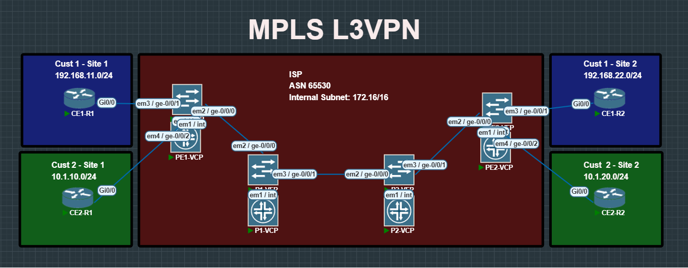

# MPLS L3VPN Lab

This repository documents a full MPLS Layer 3 VPN (L3VPN) deployment using Juniper as the provider backbone and Cisco as the customer edge.  
It is meant as an educational reference for learning and practicing MPLS L3VPN end to end.

---

## Concepts Covered
This lab demonstrates the following technologies in sequence:

1. ISIS as the IGP in the provider backbone  
2. MPLS forwarding with LDP  
3. MP-BGP for VPNv4 address families  
4. VRFs for multiple customers (Cust1 and Cust2)  
5. OSPF PE–CE routing  
6. OSPF Sham Link to fix multi-site routing issues  

---

## Topology

  

---

## Devices

Provider Backbone (Juniper JunOS):  
- PE1  
- PE2  
- P1  
- P2  

Customer Edge (Cisco IOS):  
- CE1-R1  
- CE1-R2  
- CE2-R1  
- CE2-R2  

---

## Repository Structure
| Path                  | Description |
|------------------------|-------------|
| `README.md`           | Main documentation for the lab |
| `topology/`           | Contains topology diagrams |
|  `MPLS-L3VPN.png`  | Topology image |
| `configs/`            | Device configurations |
|  `provider/`       | Provider (PE/P) configs |
|  `PE1.conf`      | PE1 configuration |
|  `PE2.conf`      | PE2 configuration |
|  `P1.conf`       | P1 configuration |
|  `P2.conf`       | P2 configuration |
|  `customer/`       | Customer CE configs |
| `CE1-R1.conf`   | Customer1 Router1 config |
|  `CE1-R2.conf`   | Customer1 Router2 config |
|   `CE2-R1.conf`   | Customer2 Router1 config |
|    `CE2-R2.conf`   | Customer2 Router2 config |
| `notes/`              | Technology explanation notes |
|   `isis.md`         | IS-IS explanation |
|   `mpls-ldp.md`     | MPLS LDP explanation |
|   `mp-bgp.md`       | MP-BGP explanation |
|   `vrf.md`          | VRF concepts |
|  `ospf-pe-ce.md`   | OSPF between PE and CE |
|   `sham-link.md`    | OSPF sham-link explanation |

